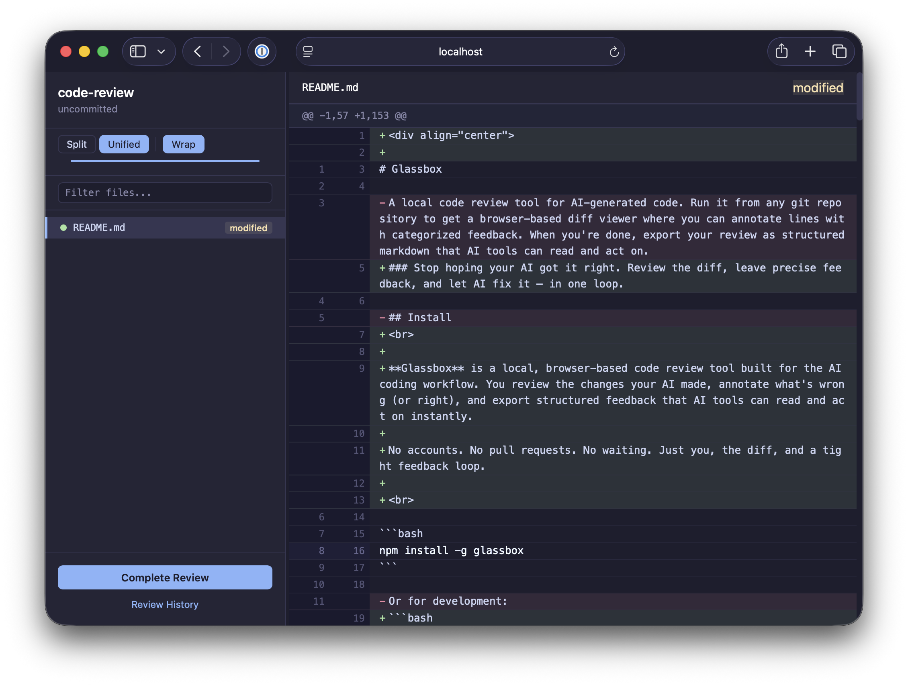

<div align="center">

# Glassbox

### Stop hoping your AI got it right. Review the diff, leave precise feedback, and let AI fix it — in one loop.

<br>

**Glassbox** is a local, browser-based code review tool built for the AI coding workflow. You review the changes your AI made, annotate what's wrong (or right), and export structured feedback that AI tools can read and act on instantly.

No accounts. No pull requests. No waiting. Just you, the diff, and a tight feedback loop.

<br>

```bash
npm install -g glassbox
```

```bash
glassbox
```

That's it. Opens in your browser. Works in any git repo.

<br>



</div>

---

## Why Glassbox?

AI coding tools generate a lot of code fast. But "fast" doesn't mean "correct." The bottleneck isn't generation — it's **review**.

Most developers review AI output by skimming files in their editor, mentally diffing what changed, and then either accepting it or rewriting it by hand. That's slow, error-prone, and throws away the most valuable signal: your expert judgment about *what specifically* was wrong and why.

Glassbox gives you a proper diff viewer with annotation categories designed for AI feedback:

| Category | What it tells the AI |
|----------|---------------------|
| **Bug** | "This is broken. Fix it." |
| **Fix needed** | "This needs a specific change." |
| **Style** | "I prefer it done this way." |
| **Pattern to follow** | "This is good. Keep doing this." |
| **Pattern to avoid** | "This is an anti-pattern. Stop." |
| **Note** | Context for the AI to consider. |
| **Remember** | A rule to persist to the AI's long-term config. |

When you're done, click **Complete Review** and tell your AI tool:

```
Read .glassbox/latest-review.md and apply the feedback.
```

The AI gets a structured file with every annotation, organized by file and line number, with clear instructions on how to interpret each category. It fixes the bugs, applies your style preferences, avoids the anti-patterns, and updates its own config with your "remember" items.

Then you run `glassbox` again. Your previous annotations carry forward — matched to the updated diff. Stale comments that no longer apply are flagged so you can keep or discard them. The loop continues until you're satisfied.

---

## How it works

```
  You                     AI
   |                       |
   |   generate code       |
   |<----------------------|
   |                       |
   |   glassbox            |
   |   review + annotate   |
   |                       |
   |   "Read .glassbox/    |
   |    latest-review.md"  |
   |---------------------->|
   |                       |
   |   updated code        |
   |<----------------------|
   |                       |
   |   glassbox            |
   |   (annotations carry  |
   |    forward)           |
   |                       |
   :   repeat until done   :
```

---

## Features

- **Split and unified diffs** with syntax-colored add/remove/context lines
- **Line-level annotations** — click any line to add feedback with a category
- **Drag and drop** annotations to different lines
- **Double-click** to edit, click the category badge to reclassify
- **Collapsible folder tree** in the sidebar with file filter
- **Resizable sidebar** and word wrap toggle
- **Keyboard navigation** — `j`/`k` to move between files, `Cmd+Enter` to save
- **Session persistence** — reviews survive restarts, pick up where you left off
- **Smart review reuse** — re-running `glassbox` on the same commit updates diffs in place and migrates annotations to their new line positions
- **Stale annotation detection** — comments that can't be matched to the updated diff are flagged with a visual indicator
- **Review history** — browse, reopen, or delete past reviews
- **Structured export** — markdown output with file paths, line numbers, categories, and instructions for AI consumption
- **Automatic .gitignore prompt** — reminds you to exclude `.glassbox/` from version control
- **Auto port selection** — if the default port is busy, it finds an open one
- **Fully local** — no network calls, no accounts, no telemetry. Your code stays on your machine.

---

## Install

```bash
npm install -g glassbox
```

Requires **Node.js 20+** and **git**.

---

## Usage

Run from inside any git repository:

```bash
# Review uncommitted changes (default, same as no arguments)
glassbox

# Review only staged changes
glassbox --staged

# Review a specific commit
glassbox --commit abc123

# Review current branch vs main
glassbox --branch main

# Review a range of commits
glassbox --range main..feature-branch

# Review specific files
glassbox --files "src/**/*.ts,lib/*.js"

# Review entire codebase
glassbox --all

# Resume a previous review
glassbox --resume
```

### All options

| Flag | Description |
|------|-------------|
| *(no flag)* | Same as `--uncommitted` |
| `--uncommitted` | Staged + unstaged + untracked changes |
| `--staged` | Only staged changes |
| `--unstaged` | Only unstaged changes |
| `--commit <sha>` | Changes from a specific commit |
| `--range <from>..<to>` | Changes between two refs |
| `--branch <name>` | Current branch vs the named branch |
| `--files <patterns>` | Specific files (comma-separated globs) |
| `--all` | Entire codebase (all tracked files) |
| `--port <number>` | Port to run on (default: 4173) |
| `--resume` | Resume the latest in-progress review for this mode |
| `--check-for-updates` | Check for a newer version on npm |
| `--debug` | Show build timestamp and debug info |
| `--help` | Show help |

---

## AI integration

The exported review file is plain markdown. Any AI tool that can read files can use it.

### Claude Code

```
Read .glassbox/latest-review.md and apply the review feedback.
```

### Cursor / Copilot / other

Point the tool at the file. The export includes an "Instructions for AI Tools" section that explains how to interpret each annotation category.

### What the AI does with it

- Fixes lines marked **bug** or **fix needed**
- Applies **style** preferences to the indicated lines and similar patterns
- Continues using **pattern-to-follow** patterns
- Refactors **pattern-to-avoid** anti-patterns
- Persists **remember** items to its configuration (CLAUDE.md, .cursorrules, etc.)
- Reads **notes** as context

---

## Architecture

| Layer | Technology |
|-------|-----------|
| CLI | TypeScript, Node.js |
| Server | Hono |
| Database | PGLite (embedded PostgreSQL) |
| UI | Custom server-side JSX (no React), vanilla client JS |
| Build | tsup (single-file bundle) |
| Storage | `~/.glassbox/data/` |

Data stays local. The only network call is an optional once-per-day npm update check.

## Development

```bash
git clone <repo-url>
cd glassbox
npm install

npm run dev -- --uncommitted    # Run with tsx (no build step)
npm run build                   # Build to dist/cli.js
npm run clean                   # Remove dist and caches
npm link                        # Symlink for global 'glassbox' command
```

## License

MIT
