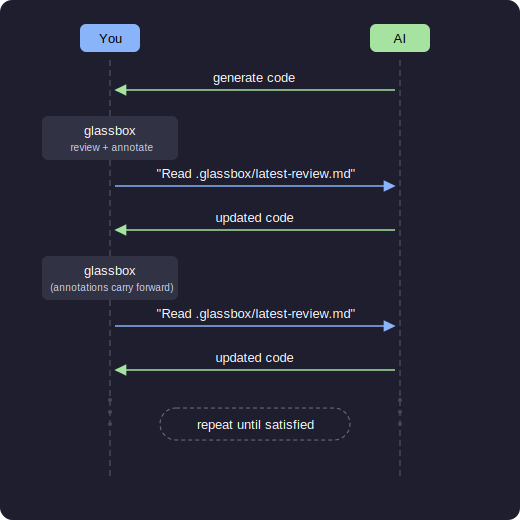

<div align="center">

# Glassbox

### Stop hoping your AI got it right. Review the diff, leave precise feedback, and let AI fix it — in one loop.

<br>

**Glassbox** is a local, browser-based code review tool built for the AI coding workflow. You review the changes your AI made, annotate what's wrong (or right), and export structured feedback that AI tools can read and act on instantly.

No accounts. No pull requests. No waiting. Just you, the diff, and a tight feedback loop.

<br>

```bash
npm install -g glassbox
```

```bash
glassbox
```

That's it. Opens in your browser. Works in any git repo.

<br>


</div>

---

## Why Glassbox?

AI coding tools generate a lot of code fast. But "fast" doesn't mean "correct." The bottleneck isn't generation — it's **review**.

Most developers review AI output by skimming files in their editor, mentally diffing what changed, and then either accepting it or rewriting it by hand. That's slow, error-prone, and throws away the most valuable signal: your expert judgment about *what specifically* was wrong and why.

Glassbox gives you a proper diff viewer with annotation categories designed for AI feedback:

| Category | What it tells the AI |
|----------|---------------------|
| **Bug** | "This is broken. Fix it." |
| **Fix needed** | "This needs a specific change." |
| **Style** | "I prefer it done this way." |
| **Pattern to follow** | "This is good. Keep doing this." |
| **Pattern to avoid** | "This is an anti-pattern. Stop." |
| **Note** | Context for the AI to consider. |
| **Remember** | A rule to persist to the AI's long-term config. |

When you're done, click **Complete Review** and tell your AI tool:

```
Read .glassbox/latest-review.md and apply the feedback.
```

The AI gets a structured file with every annotation, organized by file and line number, with clear instructions on how to interpret each category. It fixes the bugs, applies your style preferences, avoids the anti-patterns, and updates its own config with your "remember" items.

Then you run `glassbox` again. Your previous annotations carry forward — matched to the updated diff. Stale comments that no longer apply are flagged so you can keep or discard them. The loop continues until you're satisfied.

---

## How it works



---

## Features

- **Split and unified diffs** with syntax-colored add/remove/context lines
- **Line-level annotations** — click any line to add feedback with a category
- **Drag and drop** annotations to different lines
- **Double-click** to edit, click the category badge to reclassify
- **Collapsible folder tree** in the sidebar with file filter
- **Resizable sidebar** and word wrap toggle
- **Keyboard navigation** — `j`/`k` to move between files, `Cmd+Enter` to save
- **Session persistence** — reviews survive restarts, pick up where you left off
- **Smart review reuse** — re-running `glassbox` on the same commit updates diffs in place and migrates annotations to their new line positions
- **Stale annotation detection** — comments that can't be matched to the updated diff are flagged with a visual indicator
- **Review history** — browse, reopen, or delete past reviews
- **Structured export** — markdown output with file paths, line numbers, categories, and instructions for AI consumption
- **Automatic .gitignore prompt** — reminds you to exclude `.glassbox/` from version control
- **Auto port selection** — if the default port is busy, it finds an open one
- **Fully local** — no network calls (unless you opt into AI features), no accounts, no telemetry. Your code stays on your machine.
- **AI-powered analysis** *(optional)* — risk scoring, narrative reading order, and guided review to help you focus and learn as you review

---

## AI-Powered Review Intelligence

> Entirely optional. Glassbox is fully functional without it.

When reviewing a large diff, knowing *where to look first* is half the battle. Glassbox can optionally connect to an AI provider to analyze your changes and surface what matters:

### Risk Analysis

Every file is scored across six dimensions — security, correctness, error handling, maintainability, architecture, and performance — on a 0.0 to 1.0 scale. Files are ranked by their highest-risk dimension, so a single critical issue won't hide behind low averages.

When you open a file, inline risk notes highlight the specific lines and concerns the AI flagged, giving you a heads-up before you even start reading.

### Narrative Reading Order

For large, multi-file changes, the AI determines the optimal reading order: types and interfaces first, then utilities, then business logic, then integration code. Each file gets walkthrough notes that explain what changed and how it connects to the rest of the diff — like having a colleague walk you through their PR.

### Guided Review

If you're learning a new language, onboarding to an unfamiliar codebase, or new to programming, Guided Review generates educational annotations inline with the diff. Enable it in Settings and select the topics that apply to you — "Programming," "This codebase," or specific languages. Glassbox runs a separate analysis pass and inserts green "Learn" notes that explain concepts, idioms, and design decisions relevant to your experience level.

Guided Review works in all three sidebar modes (folder, risk, and narrative) and runs independently of risk or narrative analysis. When enabled, risk and narrative analysis also adjust their output to be more detailed and educational.

### How to use it

Click the shield or book icon in the sidebar to switch from the default folder view to risk or narrative mode. If you haven't configured an API key yet, a settings dialog will prompt you. Analysis runs once and results are cached for the session. To enable Guided Review, open the Settings dialog (gear icon) and check "Enable guided review."

### Supported providers

| Provider | Models | Env variable |
|----------|--------|-------------|
| **Anthropic** | Claude Sonnet 4, Claude Haiku 4 | `ANTHROPIC_API_KEY` |
| **OpenAI** | GPT-4o, GPT-4o Mini | `OPENAI_API_KEY` |
| **Google** | Gemini 2.5 Flash, Gemini 2.5 Pro | `GEMINI_API_KEY` |

You can switch providers and models in the settings dialog (gear icon in the sidebar).

### API key storage

Your API key never leaves your machine. Glassbox resolves keys in this order:

1. **Environment variables** — if `ANTHROPIC_API_KEY`, `OPENAI_API_KEY`, or `GEMINI_API_KEY` is set, it's used automatically. Nothing is stored.
2. **OS keychain** — on macOS (Keychain), Linux (GNOME Keyring / KDE Wallet via `secret-tool`), or Windows (Credential Manager). Keys are encrypted by your operating system and tied to your user account.
3. **Config file** — stored in `~/.glassbox/config.json` with `0600` permissions, base64-encoded. Use this as a fallback if your OS keychain isn't available.

Keys entered through the settings dialog are stored in the OS keychain by default when available, and never sent anywhere except directly to the AI provider's API.

---

## Install

```bash
npm install -g glassbox
```

Requires **Node.js 20+** and **git**.

---

## Usage

Run from inside any git repository:

```bash
# Review uncommitted changes (default, same as no arguments)
glassbox

# Review only staged changes
glassbox --staged

# Review a specific commit
glassbox --commit abc123

# Review current branch vs main
glassbox --branch main

# Review a range of commits
glassbox --range main..feature-branch

# Review specific files
glassbox --files "src/**/*.ts,lib/*.js"

# Review entire codebase
glassbox --all

# Resume a previous review
glassbox --resume
```

### All options

| Flag | Description |
|------|-------------|
| *(no flag)* | Same as `--uncommitted` |
| `--uncommitted` | Staged + unstaged + untracked changes |
| `--staged` | Only staged changes |
| `--unstaged` | Only unstaged changes |
| `--commit <sha>` | Changes from a specific commit |
| `--range <from>..<to>` | Changes between two refs |
| `--branch <name>` | Current branch vs the named branch |
| `--files <patterns>` | Specific files (comma-separated globs) |
| `--all` | Entire codebase (all tracked files) |
| `--port <number>` | Port to run on (default: 4173) |
| `--resume` | Resume the latest in-progress review for this mode |
| `--check-for-updates` | Check for a newer version on npm |
| `--debug` | Show build timestamp and debug info |
| `--help` | Show help |

---

## AI integration

The exported review file is plain markdown. Any AI tool that can read files can use it.

### Claude Code

```
Read .glassbox/latest-review.md and apply the review feedback.
```

### Cursor / Copilot / other

Point the tool at the file. The export includes an "Instructions for AI Tools" section that explains how to interpret each annotation category.

### What the AI does with it

- Fixes lines marked **bug** or **fix needed**
- Applies **style** preferences to the indicated lines and similar patterns
- Continues using **pattern-to-follow** patterns
- Refactors **pattern-to-avoid** anti-patterns
- Persists **remember** items to its configuration (CLAUDE.md, .cursorrules, etc.)
- Reads **notes** as context

---

## Architecture

| Layer | Technology |
|-------|-----------|
| CLI | TypeScript, Node.js |
| Server | Hono |
| Database | PGLite (embedded PostgreSQL) |
| UI | Custom server-side JSX (no React), vanilla client JS |
| Build | tsup (single-file bundle) |
| Storage | `~/.glassbox/data/` |

Data stays local. The only network calls are an optional once-per-day npm update check and AI analysis requests if you opt in.

## Development

```bash
git clone <repo-url>
cd glassbox
npm install

npm run dev -- --uncommitted    # Run with tsx (no build step)
npm run build                   # Build to dist/cli.js
npm run clean                   # Remove dist and caches
npm link                        # Symlink for global 'glassbox' command
```

## License

MIT
