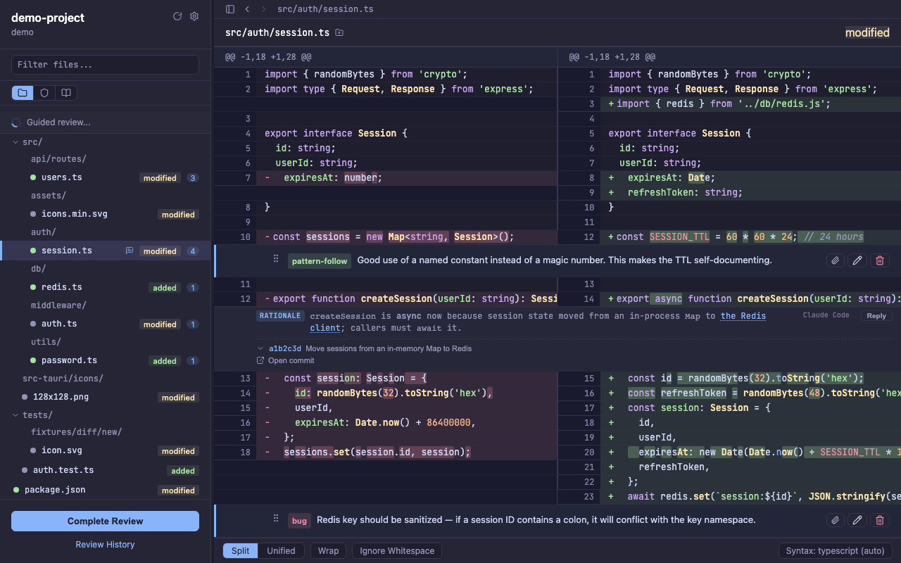
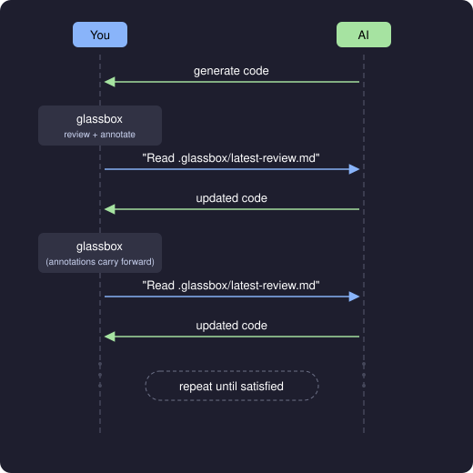
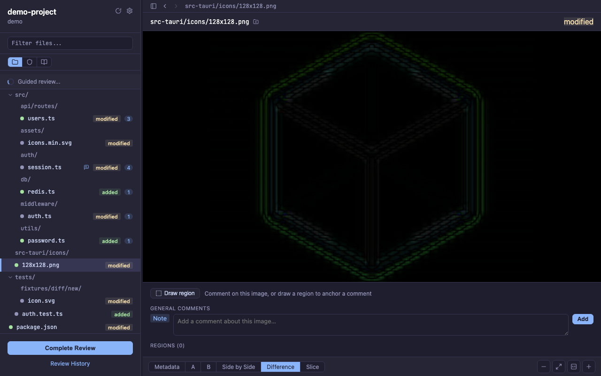
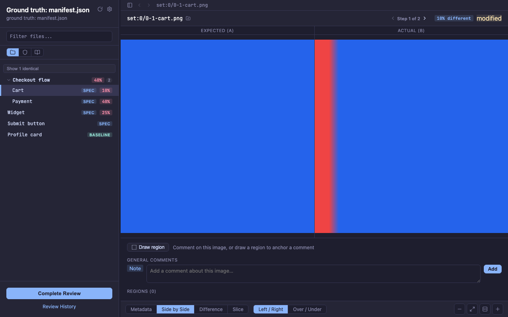
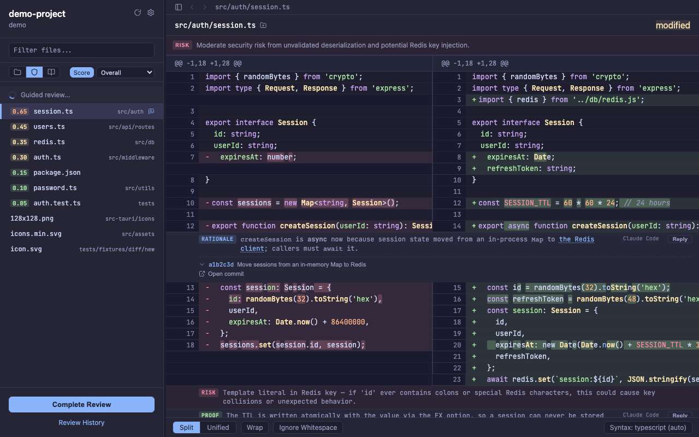
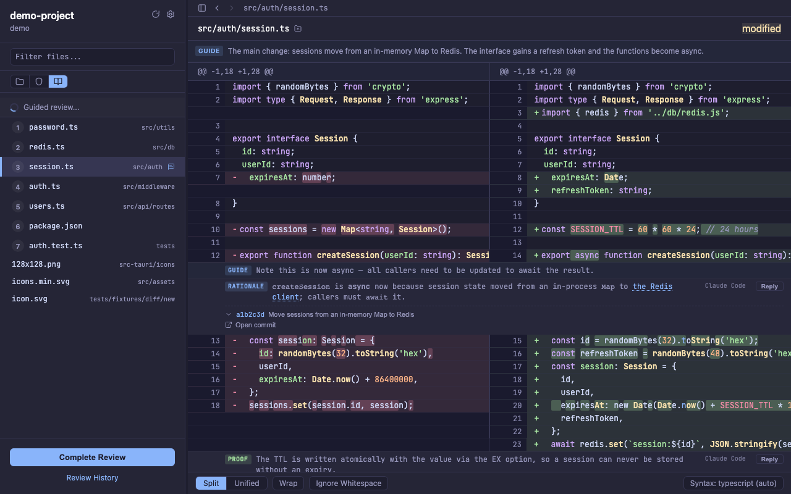
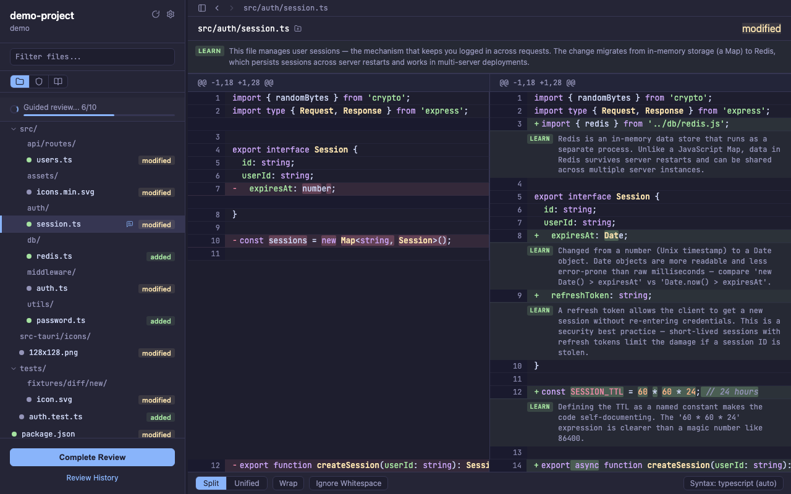
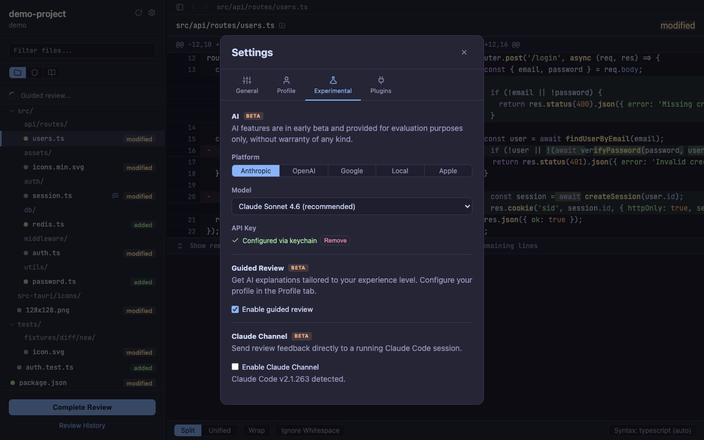
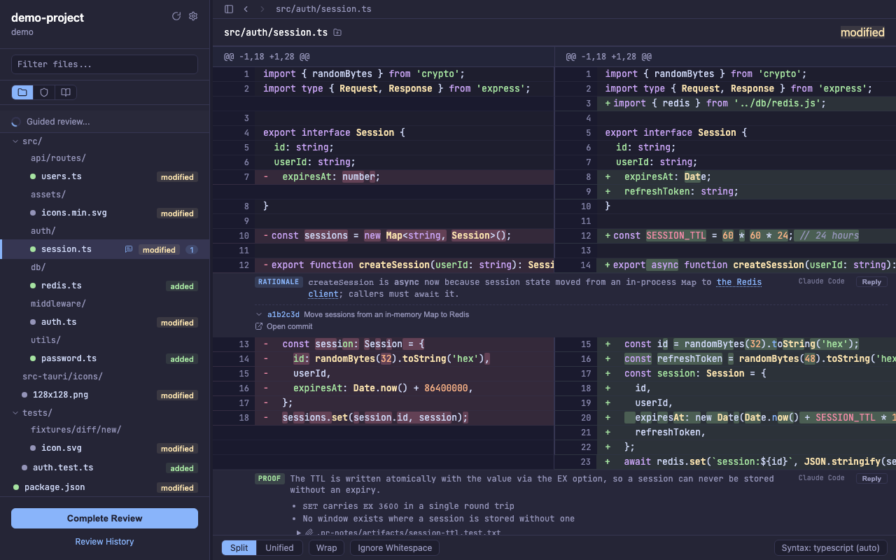

<div align="center">

# Glassbox

### Stop hoping your AI got it right. Review the diff, leave precise feedback, and let AI fix it — in one loop.

<br>

**Glassbox** is a local, browser-based code review tool built for the AI coding workflow. You review the changes your AI made, annotate what's wrong (or right), and export structured feedback that AI tools can read and act on instantly.

No accounts. No pull requests. No waiting. Just you, the diff, and a tight feedback loop.

<br>

**Desktop app** (recommended) — download from [GitHub Releases](https://github.com/brianwestphal/glassbox/releases):

| Platform | Download |
|----------|----------|
| macOS (Apple Silicon) | `.dmg` (arm64) |
| macOS (Intel) | `.dmg` (x64) |
| Linux | `.AppImage` / `.deb` |
| Windows | `.msi` / `.exe` |

After installing, open the app and click **Install CLI** to add the `glassbox` command to your PATH.

**Or install via npm:**

```bash
npm install -g glassbox
```

Then, from any git repository:

```bash
glassbox
```

That's it. Data stays local. Works in any git repo.

<br>


</div>

---

## Why Glassbox?

AI coding tools generate a lot of code fast. But "fast" doesn't mean "correct." The bottleneck isn't generation — it's **review**.

Most developers review AI output by skimming files in their editor, mentally diffing what changed, and then either accepting it or rewriting it by hand. That's slow, error-prone, and throws away the most valuable signal: your expert judgment about _what specifically_ was wrong and why.

Glassbox gives you a proper diff viewer with annotation categories designed for AI feedback:



| Category              | What it tells the AI                            |
| --------------------- | ----------------------------------------------- |
| **Bug**               | "This is broken. Fix it."                       |
| **Fix needed**        | "This needs a specific change."                 |
| **Style**             | "I prefer it done this way."                    |
| **Pattern to follow** | "This is good. Keep doing this."                |
| **Pattern to avoid**  | "This is an anti-pattern. Stop."                |
| **Note**              | Context for the AI to consider.                 |
| **Remember**          | A rule to persist to the AI's long-term config. |

As you annotate, `.glassbox/latest-review.md` is updated automatically. You can tell your AI tool at any time:

```
Read .glassbox/latest-review.md and apply the feedback.
```

The AI gets a structured file with every annotation, organized by file and line number, with clear instructions on how to interpret each category. It fixes the bugs, applies your style preferences, avoids the anti-patterns, and updates its own config with your "remember" items. You don't need to formally "complete" a review to share feedback — just annotate and switch to your AI tool.

Then you run `glassbox` again. Your previous annotations carry forward — matched to the updated diff. Stale comments that no longer apply are flagged so you can keep or discard them. The loop continues until you're satisfied.

---

## How it works



---

## Features

- **Split and unified diffs** with syntax-colored add/remove/context lines
- **Line-level annotations** — click any line to add feedback with a category
- **Image and SVG diffs** — binary images and SVGs render in a **side-by-side** layout (with a left/right or over/under toggle), a **difference overlay**, a **swipeable slice tool**, and pixel-precision synced zoom/pan. SVGs offer a *Code* / *Rendered* toggle so you can review either the source or the rasterized output.
- **Comment on images** — leave a general comment on any image, or **draw a rectangle region** to anchor feedback to a specific spot (per A/B side), just like a line annotation.
- **Ground-truth image comparison** — `glassbox --ground-truth <manifest>` compares an **actual** render against an **expected** one (a design spec, a reference, or a previous baseline — even outside the repo), scores the perceptual difference, sorts most-changed-first, and lets you **promote** a new actual to the baseline. Great for catching visual regressions.
- **Attach files to any comment** — drag, paste, or browse to attach screenshots, logs, or any file to a line comment, image comment, or note reply. Image attachments show a thumbnail and open in a lightbox; the export lists each file's path so your AI tool can read it.
- **Compare any two paths** — `glassbox --diff <A> <B>` reviews two arbitrary files or two arbitrary folders by path — no git repository required.
- **Drag and drop** annotations to different lines
- **Double-click** to edit, click the category badge to reclassify
- **Collapsible folder tree** in the sidebar with file filter
- **Right-click any file** in the sidebar — reveal in your file manager, copy its path, open it in your editor, or mark it reviewed
- **Resizable sidebar** and word wrap toggle
- **Keyboard navigation** — `j`/`k` to move between files, `Cmd+Enter` to save
- **Go-to-definition and a nav stack** — click any symbol to jump to its definition, with back/forward through your trail
- **Themes** — ten built-in themes (Dark, Light, High Contrast Dark/Light, Dracula, Tokyo Night, One Dark Pro, Solarized Dark/Light, Monokai), plus a custom theme editor with live preview
- **Session persistence** — reviews survive restarts, pick up where you left off
- **Smart review reuse** — re-running `glassbox` on the same commit updates diffs in place and migrates annotations to their new line positions
- **Stale annotation detection** — comments that can't be matched to the updated diff are flagged with a visual indicator
- **Review history** — browse, reopen, or delete past reviews
- **Structured export** — markdown output with file paths, line numbers, categories, and instructions for AI consumption
- **Automatic .gitignore** — keeps `.glassbox/` out of version control for you at launch, while leaving the per-project `.glassbox/settings.json` tracked
- **Auto port selection** — if the default port is busy, it finds an open one
- **Fully local** — no network calls (unless you opt into AI features), no accounts, no telemetry. Your code stays on your machine.
- **AI review notes** _(optional)_ — render the generating AI's line-anchored rationale and proof, committed alongside the code in `.pr-notes/`, right in the diff — and reply to any note inline
- **AI-powered analysis** _(optional)_ — risk scoring, narrative reading order, and guided review, powered by cloud, local (Ollama / LM Studio), or on-device (Apple) models

---

## Review more than code

Diffs aren't only text. Glassbox reviews **images** as a first-class diff: a side-by-side layout, a pixel **difference overlay**, and a swipeable slice tool — with synced zoom/pan. Leave a comment on the whole image or draw a region to anchor it to a spot.



And when "correct" means "matches the design," **ground-truth comparison** (`glassbox --ground-truth <manifest>`) puts each **actual** render next to its **expected** one — a design spec, a reference render, or a previous baseline, even outside the repo. Glassbox scores the perceptual difference, hides identical pairs, sorts the rest most-changed-first, and lets you **promote** a new actual to the baseline once a change is intentional. Multi-step flows render as ordered, named sets.



---

## AI-Powered Review Intelligence

> Entirely optional. Glassbox is fully functional without it.

When reviewing a large diff, knowing _where to look first_ is half the battle. Glassbox can optionally connect to an AI provider to analyze your changes and surface what matters:

### Risk Analysis

Every file is scored across six dimensions — security, correctness, error handling, maintainability, architecture, and performance — on a 0.0 to 1.0 scale. Files are ranked by their highest-risk dimension, so a single critical issue won't hide behind low averages.

When you open a file, inline risk notes highlight the specific lines and concerns the AI flagged, giving you a heads-up before you even start reading.



### Narrative Reading Order

For large, multi-file changes, the AI determines the optimal reading order: types and interfaces first, then utilities, then business logic, then integration code. Each file gets walkthrough notes that explain what changed and how it connects to the rest of the diff — like having a colleague walk you through their PR.



### Guided Review

If you're learning a new language, onboarding to an unfamiliar codebase, or new to programming, Guided Review generates educational annotations inline with the diff. Enable it in Settings and select the topics that apply to you — "Programming," "This codebase," or specific languages. Glassbox runs a separate analysis pass and inserts green "Learn" notes that explain concepts, idioms, and design decisions relevant to your experience level.

Guided Review works in all three sidebar modes (folder, risk, and narrative) and runs independently of risk or narrative analysis. When enabled, risk and narrative analysis also adjust their output to be more detailed and educational.



### How to use it

Click the shield or book icon in the sidebar to switch from the default folder view to risk or narrative mode. If you haven't configured an API key yet, a settings dialog will prompt you. Analysis runs once and results are cached for the session. To enable Guided Review, open the Settings dialog (gear icon) and check "Enable guided review."



### Supported providers

| Provider      | Models                                       | Runs                          |
| ------------- | -------------------------------------------- | ----------------------------- |
| **Anthropic** | Claude Sonnet 4.6, Opus 4.8, Haiku 4.5       | Cloud — `ANTHROPIC_API_KEY`   |
| **OpenAI**    | GPT-4o, GPT-4o Mini                          | Cloud — `OPENAI_API_KEY`      |
| **Google**    | Gemini 2.5 Flash, Gemini 2.5 Pro             | Cloud — `GEMINI_API_KEY`      |
| **Local**     | Any Ollama / LM Studio model                 | On your machine — no key      |
| **Apple**     | On-device Apple Intelligence                 | On-device (macOS) — no key    |

Available models are discovered live from each provider, so the list stays current without an app update. Switch providers and models in the settings dialog (gear icon in the sidebar).

**Local and on-device models are free, private, and offline.** Point Glassbox at any OpenAI-compatible server like [Ollama](https://ollama.com/) or [LM Studio](https://lmstudio.ai/), or — on a Mac with Apple Intelligence — run analysis on-device with Apple Foundation Models. Either way, no API key is required and your code never leaves your machine.

### API key storage

Your API key never leaves your machine. Glassbox resolves keys in this order:

1. **Environment variables** — if `ANTHROPIC_API_KEY`, `OPENAI_API_KEY`, or `GEMINI_API_KEY` is set, it's used automatically. Nothing is stored.
2. **OS keychain** — on macOS (Keychain), Linux (GNOME Keyring / KDE Wallet via `secret-tool`), or Windows (Credential Manager). Keys are encrypted by your operating system and tied to your user account.
3. **Config file** — stored in `~/.glassbox/config.json` with `0600` permissions, base64-encoded. Use this as a fallback if your OS keychain isn't available.

Keys entered through the settings dialog are stored in the OS keychain by default when available, and never sent anywhere except directly to the AI provider's API.

---

## AI Review Notes

When an AI writes or modifies code, it knows _why_ each non-obvious change is the way it is and _what proves it correct_ — and then throws that context away. The reasoning lives in the model's head at edit time, and the reviewer is left to reconstruct it from prose in a ticket or commit message.

**AI Review Notes** give the generating AI a structured, line-anchored channel to record that reasoning. The AI emits notes with the `glassbox note` command; they're stored as committed SARIF under `.pr-notes/` — tool-neutral and travelling with the repo — and Glassbox renders them review-comment-style at the exact line they apply to:

- **Rationale** — why this change, and what alternatives were rejected
- **Proof** — the test that passed, a measurement, or a before/after screenshot (notes can carry text and image artifacts)
- **Risk / assumption** — what a reviewer should double-check



You can **reply** to any note with your own annotation — threaded beneath it like a pull-request comment. When a note's code later changes, Glassbox re-anchors it to its new line and flags it **outdated**, so stale reasoning never misleads you. And because the notes are plain SARIF in `.pr-notes/`, any tool or teammate can read them — Glassbox is just the most pleasant way to consume them.

See [docs/20-ai-review-notes.md](docs/20-ai-review-notes.md) for the format and the producer-side `glassbox note` CLI.

---

## For AI tools: integrating with Glassbox

If you're an AI coding tool or agent working in a project that uses Glassbox, **[docs/ai-integration.md](docs/ai-integration.md)** is the integration hub — how to launch a review, record line-anchored rationale/proof (`glassbox note`), export ground-truth image proof, consume the exported feedback (`.glassbox/latest-review.md`), and respond to the MCP/Claude channel. The repo's [AGENTS.md](AGENTS.md) is a one-screen router to it (and, separately, to the contributor docs for agents hacking on Glassbox itself).

---

## Install

### Desktop app (recommended)

Download the latest release for your platform from [GitHub Releases](https://github.com/brianwestphal/glassbox/releases).

On first launch, the app will prompt you to install the `glassbox` CLI command. This creates a symlink so you can launch the desktop app from any project directory. You can also install it manually:

**macOS:**
```bash
sudo sh -c 'mkdir -p /usr/local/bin && ln -sf "/Applications/Glassbox.app/Contents/Resources/resources/glassbox" /usr/local/bin/glassbox'
```

**Linux:**
```bash
ln -sf /path/to/glassbox/resources/glassbox-linux ~/.local/bin/glassbox
```

The desktop app includes automatic updates — new versions are downloaded and applied in the background.

### npm

Alternatively, install via npm (runs in your browser instead of a native window):

```bash
npm install -g glassbox
```

Requires **Node.js 20+** and **git**.

---

## Usage

Run from inside any git repository:

```bash
# Review uncommitted changes (default, same as no arguments)
glassbox

# Review only staged changes
glassbox --staged

# Review a specific commit
glassbox --commit abc123

# Review current branch vs main
glassbox --branch main

# Review a range of commits
glassbox --range main..feature-branch

# Review specific files
glassbox --files "src/**/*.ts,lib/*.js"

# Review entire codebase
glassbox --all

# Compare two arbitrary files or folders by path (no git repo required)
glassbox --diff ./dist-old ./dist-new

# Compare actual images against expected/ground-truth images (no git repo required)
glassbox --ground-truth ./screenshots/manifest.json

# Resume a previous review
glassbox --resume
```

### All options

| Flag                   | Description                                        |
| ---------------------- | -------------------------------------------------- |
| _(no flag)_            | Same as `--uncommitted`                            |
| `--uncommitted`        | Staged + unstaged + untracked changes              |
| `--staged`             | Only staged changes                                |
| `--unstaged`           | Only unstaged changes                              |
| `--commit <sha>`       | Changes from a specific commit                     |
| `--range <from>..<to>` | Changes between two refs                           |
| `--branch <name>`      | Current branch vs the named branch                 |
| `--files <patterns>`   | Specific files (comma-separated globs)             |
| `--all`                | Entire codebase (all tracked files)                |
| `--diff <a> <b>`       | Compare two arbitrary files or folders by path — no git repo required |
| `--ground-truth <m>`   | Compare actual vs expected images from a manifest — no git repo required |
| `--port <number>`      | Port to run on (default: 4183)                     |
| `--resume`             | Resume the latest in-progress review for this mode |
| `--browser`            | Open in browser instead of desktop window          |
| `--check-for-updates`  | Check for a newer version on npm                   |
| `--debug`              | Show build timestamp and debug info                |
| `--help`               | Show help                                          |

### Settings file

Create `.glassbox/settings.json` in your project directory to configure per-project options:

```json
{
  "appName": "Glassbox — My Project"
}
```

| Key | Description |
|-----|-------------|
| `appName` | Custom window title and Dock name (defaults to "Glassbox — _folder name_") |

### Use as `git difftool`

Glassbox installs a companion binary, `glassbox-difftool`, that lets you register it as your `git difftool` so `git difftool --dir-diff <refA> <refB>` opens the diff in Glassbox automatically.

> Both binaries (`glassbox` + `glassbox-difftool`) are installed onto PATH together — `npm install -g glassbox` ships both via the `bin` map; the desktop app's **Install CLI** affordance symlinks both. If `glassbox` is on PATH but `glassbox-difftool` isn't (e.g. a pre-0.12 desktop install), re-run "Install CLI" from **Settings → General** to add the missing symlink.

The easiest way to register it is to let the CLI do it for you:

```bash
glassbox --register-difftool          # writes the three keys at --global scope
glassbox --register-difftool --local  # only inside the current repo
glassbox --unregister-difftool        # remove (only touches keys we set)
```

If you already have a different `diff.tool` configured, `--register-difftool` refuses to clobber it; pass `--force` to overwrite. The same controls live under **Settings → General** in the app (Register / Re-register / Unregister buttons).

If you'd rather wire it up by hand, the equivalent config is:

```bash
git config --global diff.tool glassbox
git config --global difftool.glassbox.cmd 'glassbox-difftool "$LOCAL" "$REMOTE" "$MERGED"'
git config --global difftool.prompt false
```

Then either:

```bash
git difftool --dir-diff HEAD~1 HEAD   # whole change set in one review (recommended)
git difftool HEAD~1 HEAD              # step through changed files one at a time
```

**Both modes open the whole change set as a single review.** With `--dir-diff`, git hands Glassbox both snapshot directories at once. **Per-file mode** (without `--dir-diff`) gets you the same single-session result: git invokes `glassbox-difftool` once per changed file, and the wrapper forwards each file to one long-lived Glassbox server, so every file accumulates into **one** review rather than one tab per file. git steps through the files with **no Ctrl-C between them**, and the sidebar grows live as each arrives. Each file is labeled with its repo-relative path.

When you're finished, click **Done** in the review (a difftool session shows this instead of the normal completion flow) — the `git difftool` command returns to your prompt cleanly, no Ctrl-C needed. Closing the browser tab ends the session too.

**Desktop vs browser:** the accumulating model is the same either way — only the window differs. In a browser (npm) install the review opens in a tab; if the desktop app is installed, it opens in one Glassbox window (matching what `glassbox --commit` does from the same folder) on macOS, Linux, and Windows, and per-file mode accumulates into that single window just like the browser. Closing the window ends the session.

**Under the hood:** `git difftool --dir-diff` materializes its two snapshot directories asymmetrically — the right side is symlinks pointing into your working tree, which trips up plain `git diff --no-index`. `glassbox-difftool` dereferences those symlinks into a temp tree before handing the dirs to `glassbox --diff`, then cleans up when the session ends. In per-file mode the wrapper reads each file's content before it returns (git deletes the temp files the instant the tool exits) and POSTs it to the accumulating server; the last file holds the connection open so `git difftool` stays attached until you click Done. Without the wrapper you'd see every modified file show up as a "deleted + added" pair instead of a modified entry, and per-file mode would hang waiting for a manual Ctrl-C between files.

**Alternative: skip git difftool entirely.** Glassbox's native ref-aware modes already cover the workflows `git difftool` is for and produce cleaner diffs (real `git diff`, not `--no-index`):

```bash
glassbox --commit <sha>          # review one commit
glassbox --range <from>..<to>    # review a range
glassbox --branch main           # current branch vs main
glassbox                         # uncommitted changes
```

Most users will find the native modes preferable. The `git difftool` integration exists for muscle memory.

---

## AI integration

The exported review file is plain markdown. Any AI tool that can read files can use it.

### Claude Code

```
Read .glassbox/latest-review.md and apply the review feedback.
```

Glassbox automatically generates a `/glassbox` skill for Claude Code, so you can just type `/glassbox` in Claude to have it read and apply your latest review.

### Claude Channel Integration (Experimental)

Glassbox can send review feedback directly to a running Claude Code session via MCP channels — no copy-pasting needed. When you complete a review, a "Send to Claude" button appears that pushes your feedback to Claude instantly.

Enable it in Settings → Experimental → Claude Channel, then launch Claude with channel support:

```bash
claude --dangerously-load-development-channels server:glassbox-channel
```

Requires Claude Code v2.1.80+ with channel support. See [docs/17-claude-channel.md](docs/17-claude-channel.md) for details.

### Cursor / Copilot / other

Point the tool at the file. The export includes an "Instructions for AI Tools" section that explains how to interpret each annotation category.

### What the AI does with it

- Fixes lines marked **bug** or **fix needed**
- Applies **style** preferences to the indicated lines and similar patterns
- Continues using **pattern-to-follow** patterns
- Refactors **pattern-to-avoid** anti-patterns
- Persists **remember** items to its configuration (CLAUDE.md, .cursorrules, etc.)
- Reads **notes** as context

---

## Architecture

| Layer    | Technology                                           |
| -------- | ---------------------------------------------------- |
| Desktop  | Tauri v2 (native window, auto-updates)               |
| CLI      | TypeScript, Node.js                                  |
| Server   | Hono                                                 |
| Database | PGLite (embedded PostgreSQL)                         |
| UI       | Custom server-side JSX (no React), vanilla client JS |
| Build    | tsup (single-file bundle)                            |
| Storage  | `.glassbox/data/` (local to each project)            |

Data stays local. The only network calls are an optional once-per-day npm update check and AI analysis requests if you opt in.

## Platform support

Glassbox is developed and **actively tested on macOS** (Apple Silicon and Intel). Linux and Windows builds are produced by the same codebase and are intended to work, but they are **not regularly exercised** by the maintainers, so rough edges are likely.

If you use Glassbox on Linux or Windows, contributions are very welcome:

- **Try it and report back** — even a "works for me on Ubuntu 24.04" / "crashes on Windows 11 with X" comment is useful.
- **File issues** for anything that breaks or feels off — [open an issue](https://github.com/brianwestphal/glassbox/issues).
- **Send pull requests** for platform-specific fixes, packaging improvements, or test coverage.

The goal is genuine cross-platform support; we just don't have the cycles to validate every release on every OS without help.

## Development

```bash
git clone <repo-url>
cd glassbox
npm install

npm run dev              # Build client assets, then run via tsx
npm run build            # Build to dist/cli.js
npm run tauri:dev        # Run desktop app in dev mode
npm run tauri:build      # Build desktop app for distribution
npm run clean            # Remove dist and caches
npm link                 # Symlink for global 'glassbox' command
```

## See Also

- **[Hot Sheet](https://github.com/brianwestphal/hotsheet)** — Lightweight local project management for AI-assisted development. Pairs well with Glassbox for tracking review feedback as actionable tickets.
- **[Changelog](CHANGELOG.md)** — Full release history

## Sponsor

Glassbox is free and open-source. If it saves you time on your AI workflow, consider sponsoring continued development:

[](https://github.com/sponsors/brianwestphal)

## License

MIT
