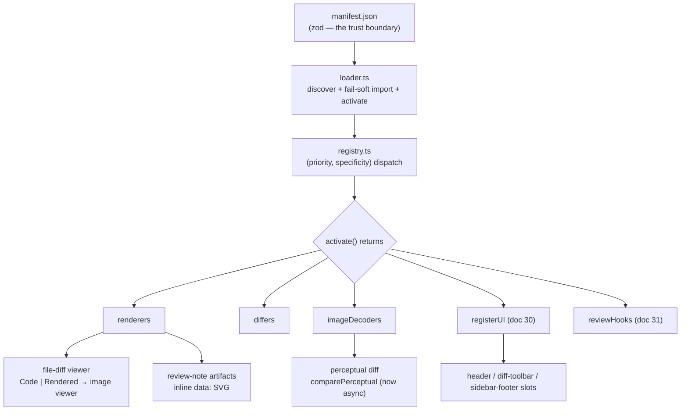

# Technical Changelog — v0.19.0 → v0.20.0

**Range:** `v0.19.0..HEAD` · **40 commits** · base tag `v0.19.0` (2026-07-02).
HEAD is untagged; **0.20.0** is the intended label, not a tag. Everything below is a
verified delta between the base tree and HEAD — grounded in the diff, not commit
prose or the (end-state) requirements docs.

## Honest size

| Area | files | +add | −del | product |
|---|---:|---:|---:|:--:|
| `src/` (app) | 52 | 3,618 | 81 | yes |
| `tests/` | 40 | 3,054 | 12 | yes |
| `plugins/` (first-party) | 25 | 1,176 | 0 | yes |
| `scripts/` | 6 | 391 | 3 | yes |
| `src-tauri/` (Rust) | 57 | 191 | 5 | yes |
| `docs/` | 13 | 1,770 | 14 | — |
| agent/skill scaffolding | 25 | 431 | 23 | — |
| generated (tauri build / assets) | 25 | 269 | 75 | — |

- **Product code only: +8,430 / −101** (`src` + `src-tauri` + `plugins` + `tests` +
  `scripts`). Raw total is +11,014 / −227 across 249 files — inflated by docs,
  `.claude`/`.hotsheet` scaffolding, and regenerated demo assets; that raw number is
  **not** engineering effort.
- **99 files added, 0 removed, 150 modified.** Roughly a third of the product churn is
  **tests** (≈22 new plugin unit/integration test files + 2 committed Playwright e2e
  projects).

## Baseline at v0.19.0 (so nothing pre-existing reads as new)

v0.19.0 already shipped the full review app: git/`--diff`/ground-truth diff modes, the
image/SVG comparison viewer with perceptual scoring, AI-authored review notes
(`.pr-notes/`), AI risk/narrative analysis, themes, the Tauri desktop app, and the
demo pipeline. It had **no plugin system of any kind** — `src/plugins/`, `plugins/`,
`docs/29`–`31`, and `src/feature-flags.ts` were all **absent** at the base tag
(verified: `git ls-tree v0.19.0 -- src/plugins plugins` → 0 files).

---

This release is one coherent feature: a **content-plugin subsystem** (specs added as
requirements docs **29** content-plugins, **30** plugin-ui-extensions, **31**
plugin-lifecycle-hooks). The pieces:

### 1. Plugin core — contract, loader, dispatcher, fallback (net-new `src/plugins/`)

`src/plugins/` is entirely new (13 modules): the `ContentRenderer`/`ContentDiffer`
contract (`types.ts`), the zod-validated manifest as the single trust boundary
(`manifest.ts`), symlink-aware discovery + fail-soft dynamic-`import()` activation
(`loader.ts`), the `(priority, specificity)` dispatcher (`registry.ts`), and the
process-global registry + `renderContent`/`diffContent`/`initContentPlugins`
(`index.ts`). Kill-switch: new `src/feature-flags.ts` (`PLUGINS_ENABLED`). Loaded at
startup — `src/server.ts` (modified) now calls `initContentPlugins`. **Both**
integration points are wired: review-note **artifacts** (`artifacts.ts` →
`renderNoteArtifacts`, rendered inertly in `diffView.tsx`) and the **file-diff
viewer** (`fileView.ts`: a plugin-rendered file becomes an SVG file with a
**Code \| Rendered** toggle routed through the image viewer — `diff/index.tsx`,
`server.ts` image route).

### 2. Four first-party plugins (net-new `plugins/`)

All under `plugins/<id>/src/` (the built `index.js` is git-ignored). **graphviz**
`.dot`/`.gv` → SVG via `@viz-js/viz` WASM (auto-installed). Three **separately
installable** (`autoInstall: false`): **plantuml** (`.puml` → SVG via a local
`java -jar` subprocess), **mermaid** (`.mmd` → SVG via a local `mmdc`/puppeteer
subprocess), and **image-codecs** (WebP/AVIF **decoders**, not a renderer). Each
plugin uses only bundled deps / Node builtins; `scripts/build-plugins.mjs` (new) is
the esbuild bundler folded into `build`/`dev`.

### 3. Image-decoder capability + async perceptual diff (doc 29 §29 / doc 26)

New additive `imageDecoders` registration key (bytes → RGBA). `comparePerceptual`
(`src/ground-truth/perceptual-diff.ts`) **became async** in this range (verified: 0
`async function comparePerceptual` at base) — it now falls back to an installed
decoder when core (PNG/JPEG) can't decode a format, so WebP/AVIF ground-truth pairs
become scorable. `src/cli.ts` (modified) inits plugins before ground-truth scoring.

### 4. Management UI, enablement, preferences, opt-in install

New Settings **Plugins** tab (`src/client/settings/pluginsTab.tsx`) + `src/api/plugins.ts`
+ `src/routes/api/plugins.ts`. New `src/plugins/enablement.ts` (global + per-project
disable, backed by new `src/project-settings-store.ts`), `settings.ts`
(manifest-declared preferences, secrets keychain-backed), and — the opt-in **install
from the UI** (readiness checks + guided setup): `readiness.ts` / `available.ts` /
`install-action.ts`, with a native Tauri folder picker (`src-tauri/` modified).

### 5. Plugin UI extensions (doc 30) + review lifecycle hooks (doc 31)

`src/client/plugins/uiExtensions.tsx` + `segmentSelection.ts` render plugin-declared
header/diff-toolbar/sidebar-footer elements (`reviewShell.tsx` slots); new shared
`src/client/toast.tsx`. `reviewHooks` (`onReviewCreated`/`onReviewCompleted`) added to
the contract.

### 6. Committed e2e (2 new Playwright projects) — caught 2 real bugs

`tests/e2e/plugin-render.test.ts` + `plugin-manage.test.ts` drive the render paths and
the management tab against a real installed fixture plugin. Building `plugin-manage`
**surfaced and fixed two genuine defects**: the preference-change delegate's `asInput`
**threw on a `<select>`** (so no select preference — incl. graphviz's `engine` — saved
from the UI), and uninstalling a bundled opt-in plugin didn't return it to the
"Available to install" list (`DELETE /plugins/:id` now refreshes both lists).

### 7. Non-plugin changes (minor)

`domotion-svg` devDep bumped 0.20.0 → 0.21.1 with a full demo re-capture (regenerated
`assets/`); app icon + browser favicon refresh; a desktop "No changes to review"
message instead of a hung loading screen; back-fill of untracked files in `--files`
mode; and the **technical-changelog** tooling itself (`scripts/changelog-analysis.mjs`
+ its skill) that produced this document.

## Dependencies

- **`devDependencies` only:** `@viz-js/viz ^3.28.0`, `@jsquash/webp ^1.5.0`,
  `@jsquash/avif ^2.1.1` (new), `domotion-svg 0.20.0 → 0.21.1`. **No core (external,
  non-bundled) dependency was added** — the WASM codec/renderer libs are **bundled
  into their plugins**, so they deliberately do NOT appear in the three-place
  external-dep list (`tsup.config.ts` / `build-sidecar.sh` / `CLAUDE.md`); verified
  neither `tsup.config.ts` nor `build-sidecar.sh` references them.

## CLI surface

No `src/cli.ts` flag added or removed in this range. Plugins are managed in-app
(Settings) and via the standalone `glassbox note` / setup helpers, not new top-level
CLI flags.
